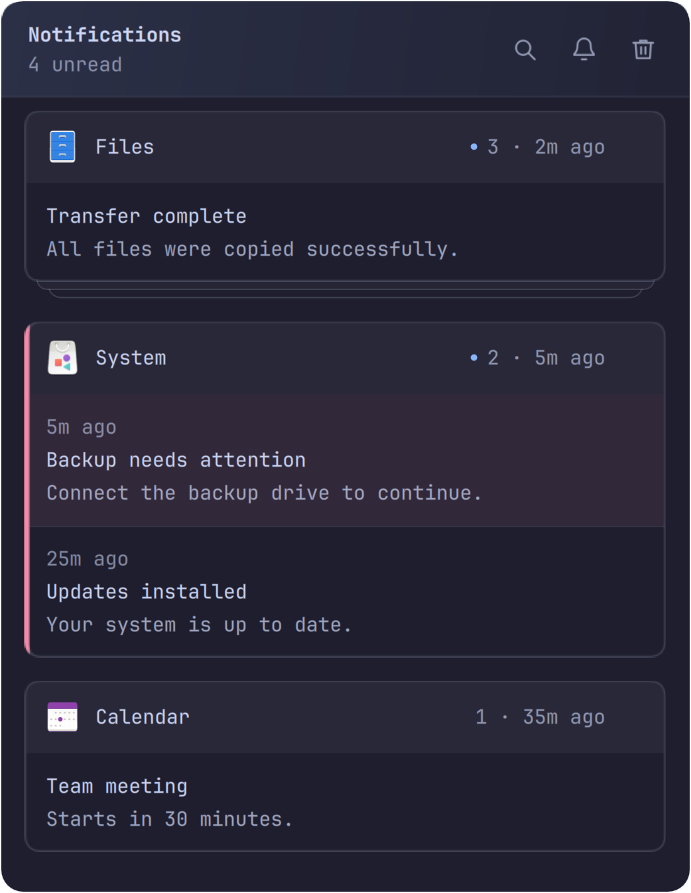

# Foamy Notification Center

Notification history with app stacks, search, and do not disturb.



## Install

Requires Omarchy Quattro with stock notifications enabled, `jq`, and
`inotify-tools`.

Picture previews also require `file` and ImageMagick 7 (`magick`). PNG, JPEG,
GIF, and WebP previews are converted to a single PNG of at most 720 × 720 pixels.
Conversion uses a plugin-local policy: no delegates or disk pixel cache, an
8,192-pixel width/height limit, a 128 MiB pixel cache, a 512 MiB process memory
limit, and a five-second timeout (forced termination after one further second).
Unsupported, oversized, or failed previews are discarded; notification text is
still archived. Missing preview tools also leave notifications without previews.

```sh
omarchy plugin add https://github.com/foamrider/foamy-notification-center.git --enable
```

## Use

- Click the bell to open the center. Click an app heading to expand its stack.
- Hover to dismiss a stack or individual notification. The trash clears the panel.
- Click search or press `/` to filter. Press Escape to close search.
- Click the silence button, or right-click the bar icon, to toggle do not disturb.

Set `language` on the widget entry in `shell.json`: `system` (default), `en`,
or `nb`. Other system languages fall back to English.

Keeps up to 1,000 notifications for 30 days by default. Silenced notifications
remain in history; stock Omarchy exceptions still apply.

## Remove

```sh
omarchy plugin remove foamy.notification-center
```

Removing the plugin leaves stock notifications running. Notification history,
saved images, and the current do-not-disturb setting remain on disk. The plugin's
archive and images are under `$XDG_STATE_HOME/omarchy-notification-center`
(default `~/.local/state/omarchy-notification-center`). Stock notification files
under `$XDG_STATE_HOME/omarchy/notifications` are also retained. Review these
directories separately if you want to delete history.

Omarchy manages the plugin entry in `shell.json`. Packages and data outside
the plugin directory are retained unless you remove them separately.

## License

[MIT](LICENSE). Based on [Omarchy Notification Center](https://github.com/jankeesvw/omarchy-notification-center).
Omarchy and Lucide notices are in [LICENSE-OMARCHY](LICENSE-OMARCHY) and
[LICENSE-LUCIDE](LICENSE-LUCIDE).

Provided **as is**, without warranty or guaranteed support. Use at your own risk.
